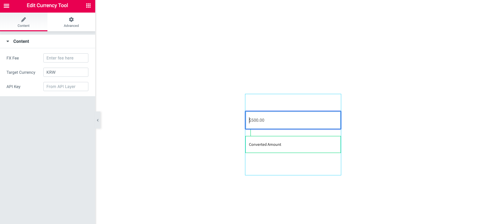
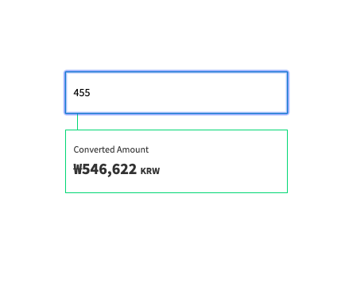

# Simple Currency Converter
=== Simple Currency Converter ===

Contributors: ejincollective
Donate link: https://www.ejincollective.com/simple-currency-converter/
Tags: currency, elementor, converter, elementor add-on, currency converter
Requires at least: 5.0.0
Tested up to: 5.2.2
Stable tag: 5.0.0

Calculate currency conversions in a flash with this custom widget for Elementor.

== Description ==

This is a custom widget plugin for Elementor that allows users to calculate currency conversions on their website.

= Special Features =

1. Final currency selector.
2. Additional fee calculator.
3. API Key input for [API Layer](https://apilayer.com/).

== Installation ==

1. Upload the entire `simple-currency-converter` folder to the `/wp-content/plugins/` directory
2. Activate the plugin through the 'Plugins' menu in WordPress
3. Go to the page you want to add the widget to.
4. Click and drag the widget from the Elementor Toolbar on the right.
5. Paste your [API Key](https://apilayer.com/) in the "API Key" field.  
6. Enter the currency code for your target currency.  

== Frequently Asked Questions ==

= Do I need an API Layer Key to use this plugin? =
Yes. As of now you must have an API Layer Key to use Simple Currency Converter.  The next version of the plugin will include support for other APIs.

== Screenshots ==
1. Widget running in preview.

2. Widget running on live site.

== Changelog ==
1.0
* Documentation created.
* Preview text updated.

== Upgrade Notice ==

== Translations ==
* Coming soon!

== Additional Info ==
* For more information visit [our website](https://www.ejincollective.com/simple-currency-converter/).

== Credits ==
* Us. We did all of this.
